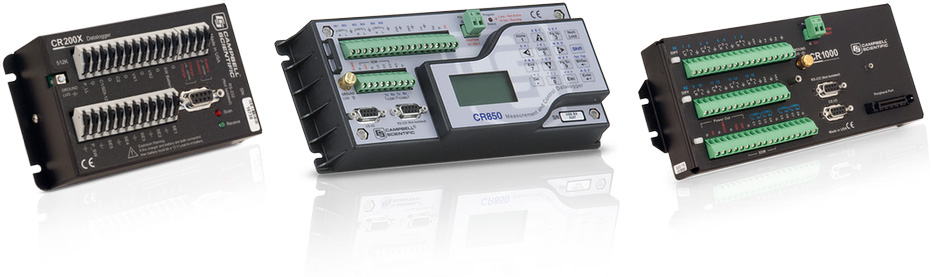

Frequently Asked Questions
==========================

General
-------

What browsers do you support and do I need any special software?
~~~~~~~~~~~~~~~~~~~~~~~~~~~~~~~~~~~~~~~~~~~~~~~~~~~~~~~~~~~~~~~~
We support the latest versions of all major browsers: Chrome, Firefox, Internet Explorer, Safari. You do not need any special plugins or addons, just ensure you have Cookies and Javascript enabled. The interface has been designed to work seemlessly across all modern phones and computing devices.

.. |google-chrome| image:: chrome.png
	:scale: 50%
	:target: https://www.google.com/intl/en/chrome/browser/

|google-chrome| We recommend `Google Chrome <https://www.google.com/intl/en/chrome/browser/>`_ for the best Eagle.io experience.

What languages do you support?
~~~~~~~~~~~~~~~~~~~~~~~~~~~~~~
English is currently the only supported language. Support for other languages is coming soon. You can however set your timezone and display preferences.

Data Loggers
------------

What types of data loggers, PLCs and RTUs are supported?
~~~~~~~~~~~~~~~~~~~~~~~~~~~~~~~~~~~~~~~~~~~~~~~~~~~~~~~~
We support Campbell Scientific data loggers that use the PakBus protocol. 
This includes the CR200, CR800 and CR1000 series.

Support for a wide range of data loggers and devices is coming soon. `Contact Us <https://eagle.io/contact/>`_ to find out how to get support for your device.

What connection options are supported?
~~~~~~~~~~~~~~~~~~~~~~~~~~~~~~~~~~~~~~
You can use a variety of transport options to connect your data logger to Eagle.io including:

TCP Client
	Connect to any device with a Public IP Address or Domain name (including DDNS)

TCP Callback 
	Allow any remote device to establish an IP connection to Eagle.io using a special identification number. You can use your modem or data logger to send the Id on initial connection.

Scout 
	The *Scout modem* is the easiest way to connect your data logger to Eagle.io. The Scout takes any standard internet ready SIM Card without the need for fixed IP addresses and has a range of smart features including inbuilt GPS, signal strength monitoring, event based reporting and low power mode.

Files
-----

What types of time series data files do you support?
~~~~~~~~~~~~~~~~~~~~~~~~~~~~~~~~~~~~~~~~~~~~~~~~~~~~
We support most types of delimited text files such as csv, loggernet and other standard formats. See :ref:`Data Source <node-configuration-datasource-datalogger>` configuration for full details.

What file transports do you support for automatic collection?
~~~~~~~~~~~~~~~~~~~~~~~~~~~~~~~~~~~~~~~~~~~~~~~~~~~~~~~~~~~~~
We currently support automatic collection from any `Dropbox <http://www.dropbox.com>`_ account.
Support is coming for `Google Drive <http://drive.google.com>`_, FTP and Email.

| 

Can I upload other types of files?
~~~~~~~~~~~~~~~~~~~~~~~~~~~~~~~~~~
Eagle.io supports uploading files of any type. You can manually upload files through the interface or use an :ref:`Attachment Source <node-configuration-attachmentsource>` for automated uploads. Please note that attachment storage incurs a fee on the owners account.
All content and files uploaded must comply with our `Acceptable Use Policy <https://eagle.io/policies/acceptableuse>`_.

Cameras
-------

Do you support cameras sending images or video files to Eagle.io?
~~~~~~~~~~~~~~~~~~~~~~~~~~~~~~~~~~~~~~~~~~~~~~~~~~~~~~~~~~~~~~~~~
Yes, you can create an :ref:`Attachment Source <node-configuration-attachmentsource>` which accepts files of any type. The files are stored as Attachments and you can set your Locations to display the most recent images uploaded. Images and video can be reviewed in the media gallery or downloaded for offline viewing.

We currently support email as the Attachment Source transport. Support for FTP is coming soon.
Your camera must have in-built support for emailing images/files with custom subject text.

Do you support live streaming video?
~~~~~~~~~~~~~~~~~~~~~~~~~~~~~~~~~~~~
Support for live streaming video with optional PTZ control (Pan, Tilt, Zoom) is coming soon.
