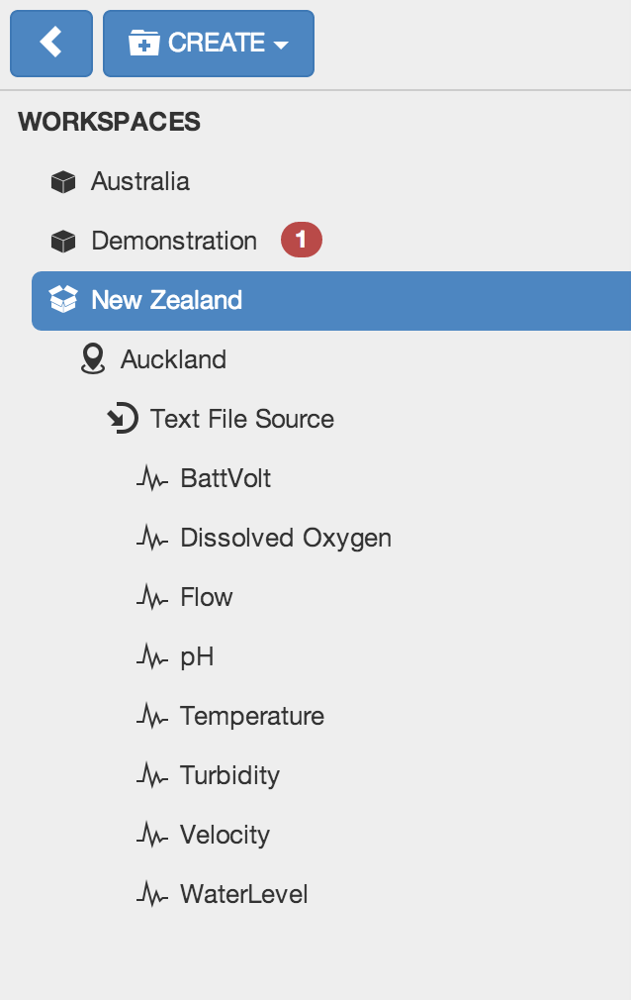

Eagle.io at a glance
====================

.. _overview:

Cloud-based, collaborative, real-time monitoring
------------------------------------------------

Eagle.io is a secure, reliable, easy to use cloud-based data monitoring service.
Whether your working with simple data files or managing a fleet of :term:`data loggers <data logger>`, Eagle.io has you covered.

With real-time communications, collaboration and instant updates built into the core Eagle.io has everything you've always wanted and more.
The lightning fast interface has been designed to work across all modern phones and computing devices with no software to install and no page reloads.

| 

Log in to eagle.io
------------------

You will need a user profile to log in. This requires you to `Sign up <https://eagle.io/signup>`_ for an account or receive a :ref:`Workspace Sharing <sharing-and-security>` invitation from a registered user.

*Login form*

.. image:: public_login.png
	:scale: 50 %

| 

1. Login button for email & password authentication
2. Link to reset your password
3. Login with your Google+ or Yahoo! account

Layout and Navigation
---------------------

The user interface is divided into sections which group similar functionality and content.
The layout of these sections will vary depending on the screen size of your device including its orientation (portrait or landscape). The figures below highlight the Main features of the interface as displayed on different devices.

*Desktop layout*

.. image:: ui_layout_desktop.png
	:scale: 50 %

| 

*Phone and Tablet layout*

.. image:: ui_layout_phone.png
	:scale: 50 %

| 

*Main features*

1. Create Menu
2. Filters
3. Status Bar
4. User Menu, Help and Fullscreen mode
5. View Selector
6. Toolbar
7. Content Area
8. Workspaces Menu
9. Workspaces Menu show/hide button

Selecting Nodes in the Workspaces Menu
~~~~~~~~~~~~~~~~~~~~~~~~~~~~~~~~~~~~~~~~

The Workspaces menu displays all the Workspaces and associated content you have access to. Each item in this menu is called a Node. The highlighted item is referred to as the Selected Node.

Most Nodes are hierarchical and may also contain Nodes themselves. The *Workspaces* label is the best example of this as its referred to as the Base Node and contains all the Workspace Nodes.

*Example Workspaces Menu showing hierarchy*

| 

Change the Selected Node by clicking or touching on another Node. You will notice that container Nodes (with the exception of the Base Node) will automatically expand and collapse to show and hide their contained Nodes on selection.

Selecting a Node focuses your View. Only the selected Node and the Nodes it contains will be available in the Content Area.

You can easily show all content by selecting the Base Node.

.. note::
	The Workspaces Menu will be hidden by default when displayed on small screens. You can see the Selected Node displayed in the Status Bar. Double-click or Double-tap the status bar to quickly reveal the Workspaces Menu. Alternatively you can use the Workspaces Menu show/hide button.

*Most common types of Nodes:*

|icon-workspace| Workspace
	Workspaces are special container Nodes that can be shared with other users. All other Nodes are created within the Workspace. Workspaces can only be created by the Account Owner or Administrators.

|icon-group| Group
	Groups are simple Nodes that provide structure to your Workspaces. You may choose to group content by geography or related purpose. Groups can be created inside Workspaces, Locations and other Groups.

|icon-location| Location
	Locations are special containers used to associate data with a geographical location.
	Locations can be created inside Workspaces and Groups.

|icon-datasource| Data Source
	Data Sources automatically acquire or receive timeseries data using a variety of different transport options. Connect to a :term:`data logger` or collect data from files. Data Sources can be created inside Locations only.

|icon-point-number-range| Parameter
	Parameters are managed by and contained within Data Sources. Parameters store the individual timeseries acquired by its Data Source. 
	There are a few different types of parameters but essentially they support Monitoring or Controlling of values.

Review the full list of :ref:`Node types <node-types>`.

Changing the View
~~~~~~~~~~~~~~~~~~

The Selected Node (including any Nodes it contains) can be displayed in a variety of Views.
Use the View Selector to change the View. You will notice the Content Area and Toolbar change.

*Content Views*

|icon-map| Map
	Map provides a fully featured interactive interface for displaying location based data.

|icon-list| List
	Intuitive categorised lists provide quick access to the data for your most important Nodes: Locations, Sources, Parameters, Attachments.

|icon-chart| Chart
	Use the Chart View for reviewing your timeseries data in highly interactive charts. Choose to group data on charts by Location or Parameter type.

|icon-events| Events
	Every interaction (user and system generated) is recorded in the Events log. 
	Use the Events View to quickly audit the system, a user or history of alarms.

|icon-dash| Dash 
	The Dashboard allows you to display your data in graphical format using gauges, buttons and other custom widgets.
	Note: This feature is currently not available.

User Menu
~~~~~~~~~

The User Menu provides quick access to the User Profile, Account Management, Log out and Help.

Context Menus
~~~~~~~~~~~~~

Context menus are built into the interface and provide quick access to navigation, operations and configuration for their associated elements. Right-click or long-press on a Node in the Workspaces Menu or an item in the Content Area (ie. Map marker, List item, etc.) to display it's associated context menu.

*Example Context menu shown for Map marker*

.. image:: context_menu.png
	:scale: 50 %

| 

.. note:: 
	Context menus display only the items relevant to the associated Node or content the menu was displayed for. Context menu items are also dependant on User permissions. If there are no available options then no context menu will be displayed.

Click, Touch, Tap, What?
~~~~~~~~~~~~~~~~~~~~~~~~

The user interface has been designed to work seemlessly across all modern computing devices including desktop computers, tablets and phones which means it has built-in support for Touch devices.

*Throughout this documentation you will notice the following terms:*

Click, Touch, Tap
	Use a mouse to select an item or touch the screen (touch device only) momentarily where the item is displayed.

Double-click, Double-tap
	Click the item twice in quick succession with a mouse, or Tap the item twice with a touch device.

Right-click, Long-press
	Using a dual button mouse, use the alternate button to Click. When using a single button mouse or touch device you need to click (or touch) and hold without releasing for a few seconds.

Inline help
-----------

|icon-help| Help is available throughout the interface - wherever you see the help icon.
You can hover, click or touch the help icon to show the help popup - many of which have quick links back to the relevant section in this documentation.

*Inline help example*

.. image:: inline_help.png
	:scale: 50 %

| 

Offline use
-----------

Eagle.io requires an internet connection for use. A disconnected notice will be displayed when the connection to the servers has failed. Normal operation will resume once the connection has been re-established. 

.. image:: disconnected_notice.png
	:scale: 50 %

| 

.. note:: 
	You may notice the app refresh after the connection is re-established after a long timeout or when updates have been released.

	
