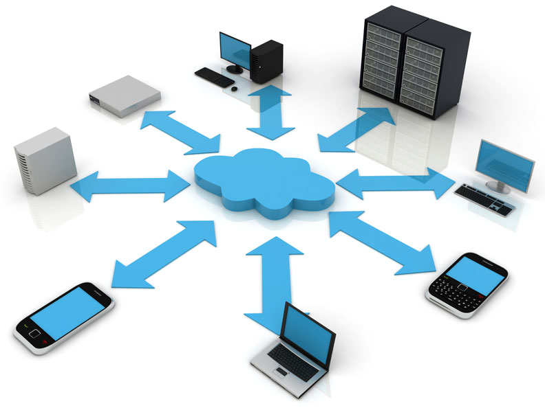

Overview
========

.. image:: /_static/coming-soon.png

Cloud-based communications
--------------------------

	diagram of eagle.io components showing end-point communications. ie. dropbox, ftp, email, :term:`data logger` over public ip, scout / callback comms, vpn connectivity, cameras, sms in both directions, etc.

Real-time monitoring and control
--------------------------------

info about direct comms to your logger and being able to configure it yourself, etc.
instant updates, direct feedback for all operations

Collaborative by design
-----------------------

info about collaborative features, including workspace sharing, privilleges and user role assigment, etc.

	- dot points