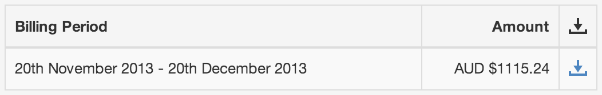

Contact and Billing
===================

|icon-billing| Please ensure your contact and billing details are always up to date so that we can contact you when required.

Contact
-------

**Account name** is used in notifications sent to Workspace users and administrators so it should uniquely identify yourself or your organisation.

**Phone** number should follow the standard `international format`_ starting with '+' and including country and area code.

**Email** address is used for all account related correspondance with Eagle.io. This email address may be different to your personal profile email.

.. note:: 
	Public enquires will also be sent to this address for Premium and Enterprise accounts.

Billing
-------

Credit Card information must be kept up to date. You will be notified about any failed transactions.
Enterprise and other high volume customers can contact support@eagle.io to find out about alternate billing methods.

Billing History
---------------

The Billing History section displays a list of all previous account bills available for download.

| 

.. _international format: http://en.wikipedia.org/wiki/National_conventions_for_writing_telephone_numbers