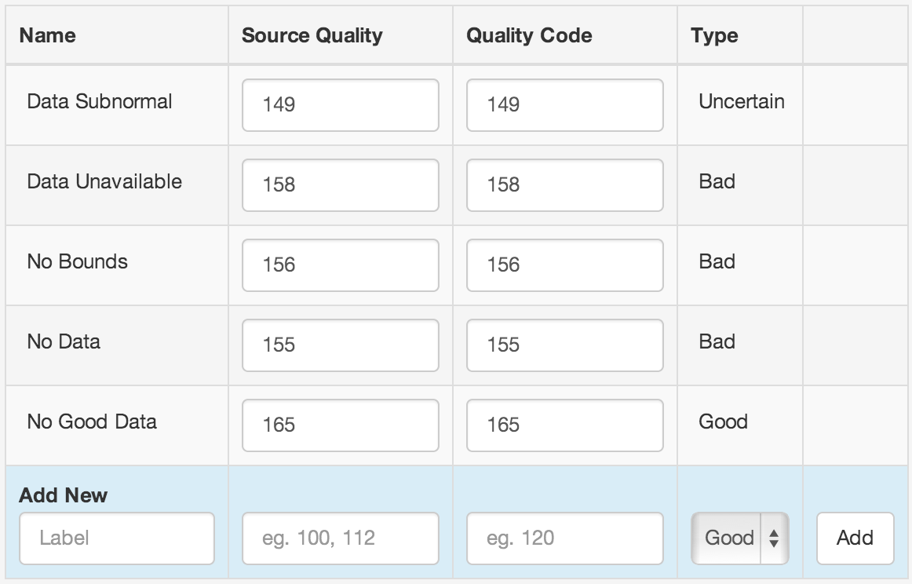

General
=======
|icon-backend| General section allows you to configure the following:

Changing or Cancelling the Account
----------------------------------
The Overview section displays the current *Account Type*. 

Click or touch the *Change* button to Change or Cancel the account. Follow the on-screen instructions to proceed.

.. note:: 
	You must be logged in as the Account Owner to change or cancel the account.

.. _management-general-qualitycodes:

Quality codes
-------------
The Quality Codes section displays a list of the currently configured data Quality Codes for this Account. Refer to the :ref:`Quality reference <historic-quality>` for full details about system quality codes.

| 

Source Quality
	Quality Code for data acquired with a Datasource

Quality Code
	Output quality code for exports, etc.

.. note::
	System qualities can not be removed, but can be updated with new Quality Codes.
