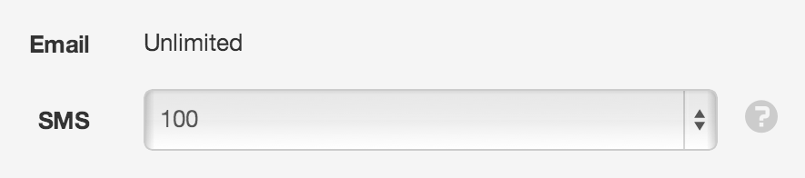
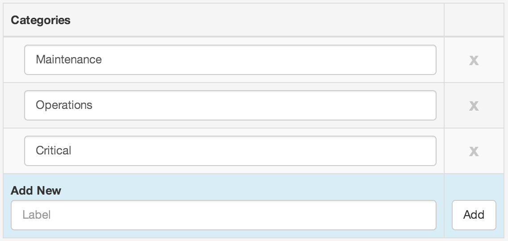

Notifications
==============

|icon-notification| Notifications section is used to configure the Notification Limits and Categories for the currently selected account.

Notification Limits
-------------------
Email notifications are free and unlimited.

SMS notifications incur charges on the Owners Account. You can restrict the total number of SMS's allowed to be sent from your account per billing period. You can also choose to *Disable*  SMS or set to *Unlimited*  for no restriction.

The account owner will receive an Email from the system when the total number of SMS sent within the current billing period gets close to the selected limit. Another Email will be sent when the limit is reached and no further notification SMS's will be sent until the next billing period.

| 

Notification Categories
-----------------------

Notification Categories provide a mechanism for users to filter the notifications they receive from a Node they are subscribed to.
All Nodes, States and/or Alarms that provide a Notify option require a category to be specified.
Users must individually select the categories in each Workspace they would like to receive notifications for.

Add, rename and remove categories as necessary.

| 

.. note:: Removing categories will also remove associated user notification preferences. There must always be atleast 1 category configured.

