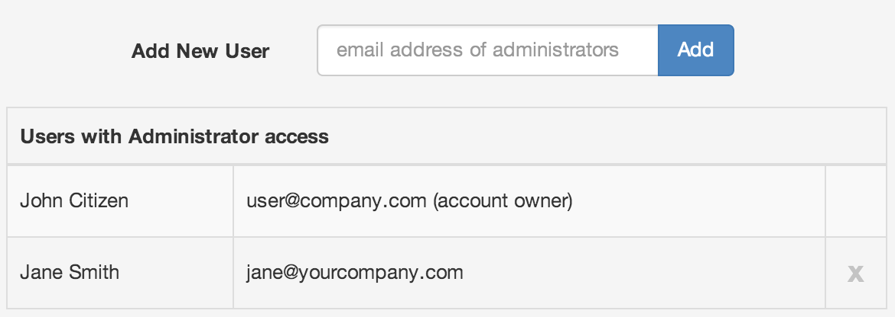
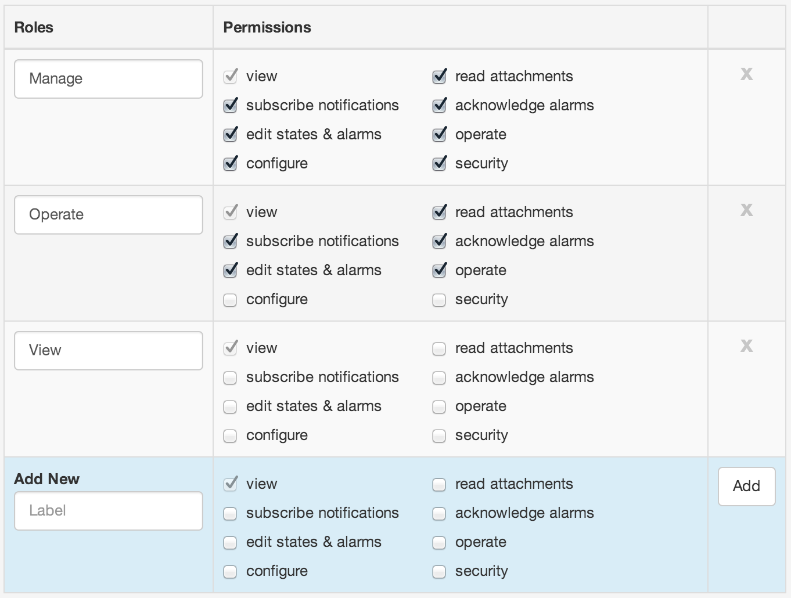

Security
========
|icon-security| Security allows you to configure Administrators of the account and User roles.

.. _management-security-administrators:

Administrators
---------------
Administrators have full access to your account but can not Close or Change the account type.
You should only add trusted users as Administrators to keep your account secure.

Administrators automatically receive unrestricted access to all Workspaces and configuration settings for the account. There is no need to explicitly Share a Workspace with any Administrators of the same account.
If you would like a User to have restricted access to Workspaces, then DO NOT add them as Administrators. Instead use Workspace Sharing to add them as a User of a Workspace with an assigned role.

| 

.. note:: 
	You can not remove the Account Owner or your own profile. 

.. _management-security-userroles:

User roles
----------
User Roles are assigned when Sharing a Workspace with a User to restrict access to that Workspace.
Create unlimited new roles, or change existing roles as necessary.
Roles have permissions associated with them which define the allowed features and functionality.

*Default User Roles*

| 

*Permissions*

View
	Minimum required permissions to log in and view content.

Read attachments
	Preview and Download attachments.

Subscribe notifications
	Subscribe to Nodes and receive Email and SMS notifications.

Acknowledge alarms
	Acknowledge alarms with or without comment.

Edit states & alarms
	Configure Node States and assign Alarms.

Operate
	User can Acquire and Control Datasources and Parameters.

Configure
	Create, Modify & Delete Nodes and associated configuration or Upload Attachments.

Security
	Workspace Sharing and assignment of User Roles.

.. note:: 
	Security and Sharing changes take effect immediately on save. Users currently logged into the system which are affected may notice the interface reload as the changes are applied.
