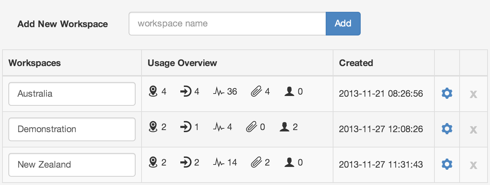

Workspaces
==========

|icon-workspace| The Workspaces section displays a list of all Workspaces belonging to the currently selected Account.
The Usage Overview shows a current snapshot of the Nodes being used for each Workspace. It also displays a count of Users (not including Administrators and Owners) that have access to each Workspace.

| 

You can add a new Workspace, rename or remove existing Workspaces or configure Sharing and Security via the properties icons.

.. note:: 
	Workspaces can be created, renamed or modified directly from the Workspaces Menu.

