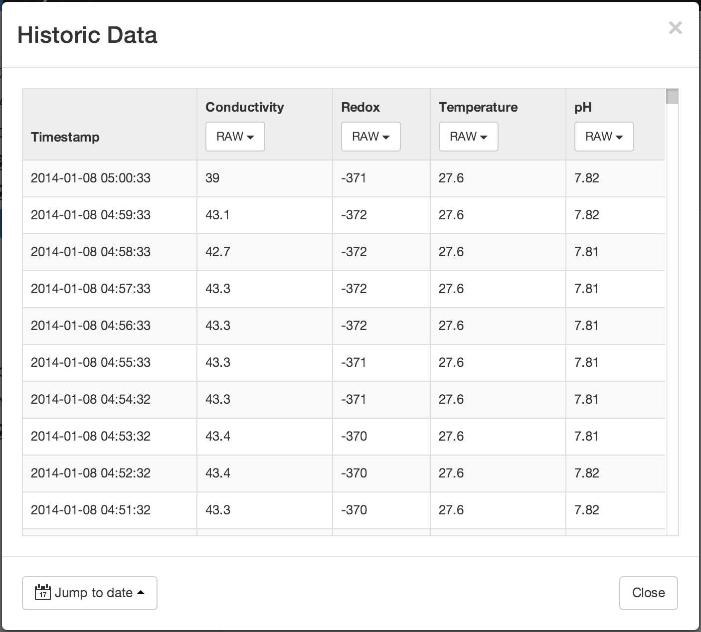
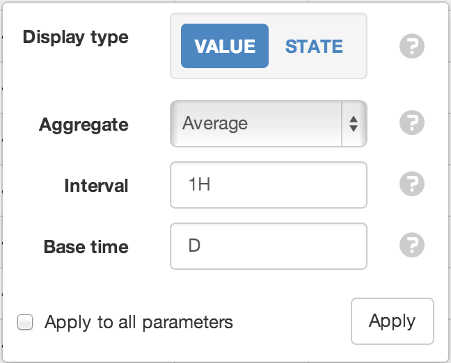
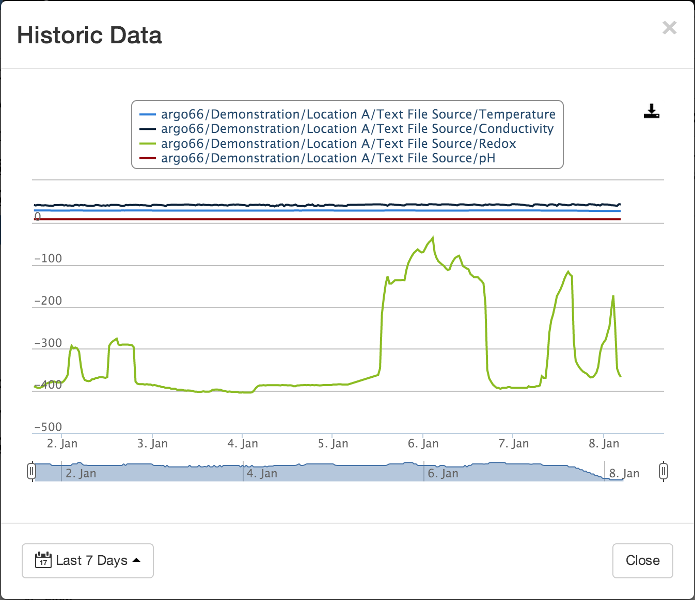

Historic Data
==============

|icon-history| Historic data is always associated with an individual Node.
You can store more than a billion individual data points per time series. This may include high-resolution millisecond data or historic records from the past 100+ years. 

Data is always stored in a raw unprocessed format with optional quality information. 
You can display and export the data in tabular or chart format.

Use :ref:`historic aggregates <historic-aggregates>` to process the raw data and apply specific calculations for statistical analysis.

Table
------
|icon-table| Historic table is accessible from the List View toolbar and Node context menus. The most recent data is always displayed first. Scroll down to automatically load older data. 

The :term:`timestamps <timestamp>` are always displayed in your preferred timezone and time format. See configuring :ref:`User Preferences <user-preferences>` for full details.

Use the *Jump to date* control to quickly move to a specific date.

| 

Use the display options drop down at the top of each column to specify how the data should be displayed including any aggregate calculations to be applied.

| 

Display type
	*Value* displays the parameter values.
	
	*State* displays the state name associated with each value.
Aggregate
	Aggregates provide a method to resample raw data over a specified period. See the :ref:`list of available aggregates <historic-aggregates>` for full details. Select RAW to display the original raw data with no aggregation applied (Interval and Base time options will be hidden).
Interval
	Specify the data range that is included for each calculated value. Example *30M* will calculate a value for each 30 minute window of data.
Base time
	Base time is used to determine the start of the aggregate calculations. Example *D+9H* will start the calculations at 9am (start of current day + 9 hours). See :ref:`working with relative time <relative-time>` for full details.
Apply to all parameters
	Check this option if you would like to apply the current column configuration to all other parameters.

.. note:: 
	Historic data for all parameters being displayed is automatically interleaved, therefore you may notice empty cells where the parameter(s) do not have a value for the corresponding row timestamp.

Charts
------

|icon-chart| Chart is accessible from the List View toolbar and Node context menus. The Historic Chart provides the same functionality as the charts displayed in Chart View but can be displayed directly from the Workspaces Menu, Map or List View without navigating away from your current view. Use the date range selector to quickly adjust the date range being shown on the chart.

Refer to :ref:`working with charts <working-with-charts>` for full details on chart interaction and functionality.

| 

Exports
-------

|icon-export| Export feature is currently not available. You can copy/paste directly from the Historic Table or Download the Historic Chart.
