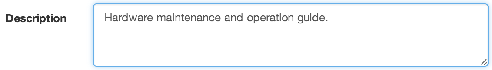

Attachment
==========
|icon-attachment| File or document stored in eagle.io. New attachments can be uploaded manually by a user or acquired via an Attachment Source. Attachments can be created inside Workspaces, Locations, Groups and Attachment Sources.

To view attachments navigate to :menuselection:`List View --> Attachments`. You will see a list of all attachments within the Selected Node. Requires *View Attachments* permission.

Properties
----------
.. include:: properties.rstx

General
~~~~~~~
The General section allows you to enter a *description* for the attachment which is displayed in List View.

| 

