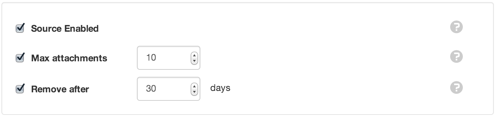
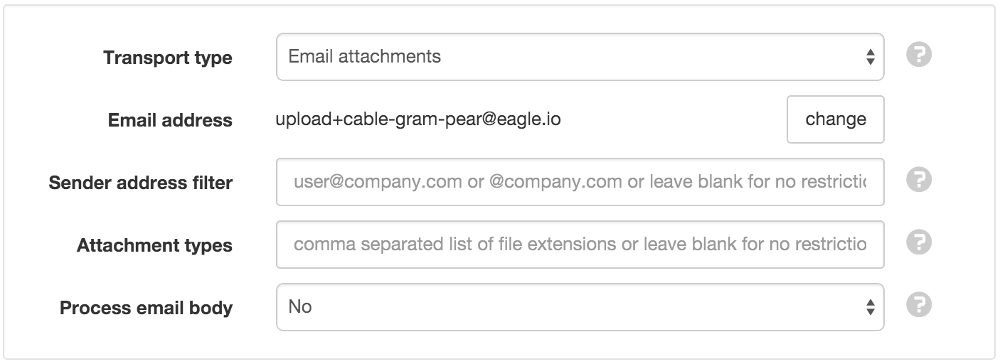
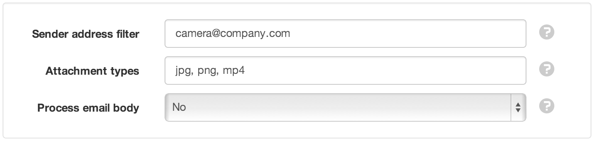

Attachment Source
=================

|icon-attachmentsource| Attachment Sources have the ability to automatically acquire or receive Attachments. Attachment Sources can be created inside Locations only.

Properties
----------
.. include:: properties.rstx

General
~~~~~~~

Source Enabled
	Uncheck the Source Enabled checkbox to stop collection and prevent alarms and notifications from triggering.

Max attachments
	Enable this setting to specify the maximum number of attachments allowed within this Source. When new attachments arrive and the limit is exceeded, the oldest attachments are removed.

Remove after
	Enabled this setting to specify the maximum number of days that attachments will be kept in this Source. The expired attachments will only be removed when new attachments arrive.

| 

Connection
~~~~~~~~~~

Transport type
	Select the transport used to acquire attachments. This is currently restricted to email only.
	Email attachments to upload@eagle.io.

Subject text
	The subject of the email must appear exactly as shown. Click *change* to generate a new subject.

| 

Communications Alarm
	See Alarms and Notifications section..... or INCLUDE the content here

.. image:: source_connection_alarm.png
	:scale: 50 %

| 

Collection
~~~~~~~~~~

Sender address filter
	For added security you can filter attachments by sender email address. Restrict to a specific email address or use \* to match multiple addresses from the same domain. Example: \*@company.com

Attachment filter
	Enter an attachment filter to restrict the files(s) that get saved as attachments. Use \* as a wildcard character. Example: \*.jpg to save all jpg images.

Process email body
	**No** only the attachments will be processed.

	**Plain Text** will store the text content of the email in addition to any attachments.

	**HTML** will store the HTML content of the email in addition to any attachments.

| 

Outdated Alarm
	See Alarms and Notifications section..... or INCLUDE the content here

.. image:: source_collection_alarm.png
	:scale: 50 %

| 

