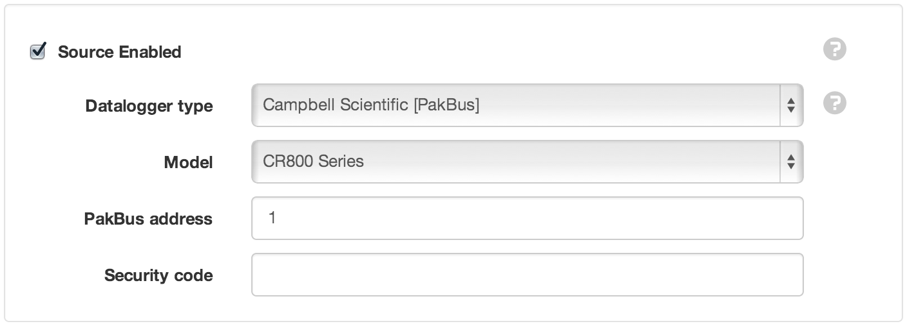
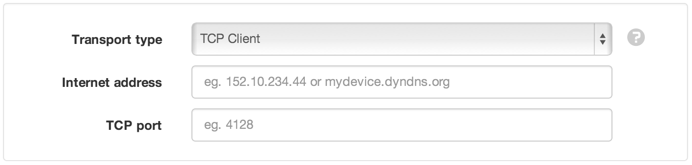
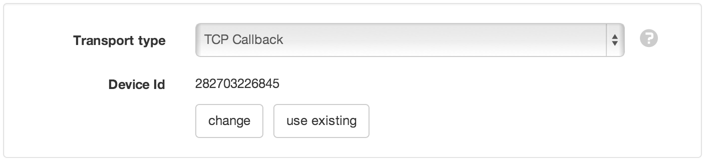
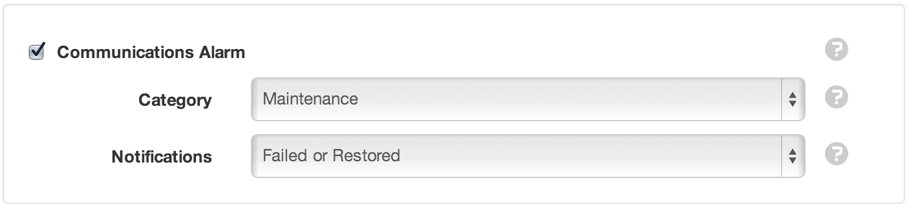
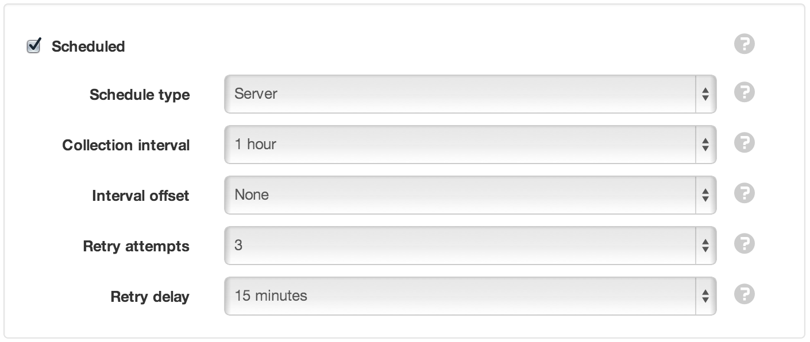
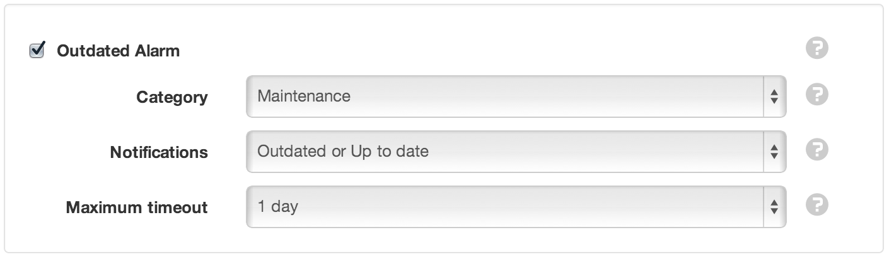

.. _node-configuration-datasource-datalogger:

Data Source (data logger)
=========================
|icon-datasource| Data Sources automatically acquire or receive timeseries data using a variety of different transport options. Connect to a :term:`data logger` or collect data from files. Data Sources can be created inside Locations only.

The type of Data Source (data logger or file) is selected at time of creation and cannot be changed. This section is specific to data logger Data Sources.


Properties
----------
.. include:: properties.rstx


General
~~~~~~~
Source Enabled
	Uncheck the Source Enabled checkbox to stop collection and prevent alarms and notifications from triggering.

Data logger type
	Select the type of data logger you would like to connect to.

Campbell Scientific [PakBus]
````````````````````````````
Model
	Select the model of the data logger (use CR1000 if your model is not shown).

PakBus address
	Default value is 1.

Security code
	Leave blank if the device has no security code.




| 


Connection
~~~~~~~~~~
Retry attempts
	Select how many retry attempts are made during an acquisition or scheduled collection before the communications is considered failed.

Retry delay
	Select the delay between retry attempts. The retry attempts multiplied by the retry delay should not exceed the collection interval.

Transport type
	Select the transport used to acquire files.


TCP Client
```````````
TCP Client is used to establish an IP connection to a data logger connected to the internet.

Internet address
	IP address or Domain name where the device can be contacted.

TCP Port
	TCP Port of the connected device.



| 


TCP Callback
````````````
TCP Callback allows the remote device to establish an IP connection to eagle.io using an identification number.

Device Id
	The unique identification number generated by the system for this Source. You can use an existing device id if it was previously assigned to a Data Source and no longer in use.



| 


Scout
``````
Scout should be used with a *Scout modem* to enable all the device smart features.

Device Id
	The unique 15 digit IMEI number assigned to the *Scout modem*. Printed on the back of device.

.. image:: datasource_datalogger_connection_scout.png
	:scale: 50 %

| 

.. note:: You need to *Save* the Source before you can change the Device settings.


Communications Alarm
	See Alarms and Notifications section..... or INCLUDE the content here



| 


Collection
~~~~~~~~~~



| 

Scheduled
	Enable the schedule for automatic data collection. You should Disable the schedule when using the TCP Callback Transport for event based callbacks (ie. not permanently connected).

Schedule type
	*Server* is the recommended option for always connected devices and allows easy schedule configuration.

	*Remote* enables a *Scout modem* to maintain its own schedule allowing for low power mode and customised configuration.

Collection interval
	Select the frequency of the collection.

Interval offset
	Offset the collection interval to prevent collection occuring on the interval. eg. 1 hour collection interval will occur at 9am, 10am, etc. Set an interval offset of 5 minutes and the collection times will be 9:05am, 10:05am, etc.



| 

Outdated Alarm
	See Alarms and Notifications section..... or INCLUDE the content here

