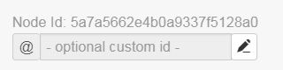
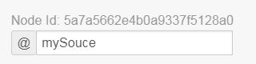

.. _processing-and-logic:

Processing and Logic
====================

Processing and Logic provides a programming environment to perform calculations, make decisions and take actions.

Some examples include:

- :ref:`Calculate average of multiple Parameters <example1>`
- :ref:`Transform a series using an equation <example2>`
- :ref:`Generate a series forecast to provide predictive alarming <example5>`

Programs are expressed as `JavaScript <http://www.ecma-international.org/ecma-262/5.1/>`_, stored as configuration in Process Nodes, and executed on a schedule or automatically as new data is acquired. Each program can interact with all Nodes in the current Workspace and any associated time-series data.

.. _process-nodes:

Process Nodes
-------------
There are two types of Nodes that can have a program defined as part of their configuration. The first is a Process Parameter that allows you to transform existing data; the second is a type of Data Source called a Processor that allows you to create new data values.

A program should include three distinct stages:

- Define input nodes (using the NODE, NUMBER, TEXT, TIME or BOOLEAN functions)
- Apply processing to input nodes (or associated time-series data)
- Output results (either by returning a value or setting an attribute of a node)

.. table::
    :class: table-fluid

    ======================   ==========================   ==================================
    \                        Process Parameter            Processor
    ======================   ==========================   ==================================
    **Node Type**            Parameter                    Data Source

    **Number of inputs**     3                            25

    **Number of outputs**    1                            100

    **Execution trigger**    On input update              On input update or schedule

    **Maximum Duration**     0.2 seconds                  2 seconds

    **Output timestamps**    Defined by first input       Defined by first input or schedule
    ======================   ==========================   ==================================

.. _process-parameter:

|icon-point-number-range-process| Process Parameter
~~~~~~~~~~~~~~~~~~~~~~~~~~~~~~~~~~~~~~~~~~~~~~~~~~~

A Process Parameter is a type of Parameter that has a program defined as part of it's configuration and can be created under any Data Source. The first input referred to by the program will be used to define the timestamps used by the output of the process. Each execution of the program must return a single output value of the expected type (or an array containing the output value and quality). This output can then be viewed in the same way as any other Parameter (for example, it can be shown as a table or chart, exported, used as input for a different process, etc.). The output can also have states defined which will trigger alarms.

Examples
________

.. _example1:

.. code-block:: javascript
    :linenos:

    // Calculate the average currentValue of Parameters from different Locations
    var param1 = NODE('Location 1/Source/Param');
    var param2 = NODE('Location 2/Source/Param');
    var param3 = NODE('Location 3/Source/Param');

    return (param1 + param2 + param3) / 3;

.. _example2:

.. code-block:: javascript
    :linenos:

    // Transform the currentValue of Param using a 3rd order polynomial
    var a = 7.24;
    var b = -10.004;
    var c = 4.328;
    var d = -0.4667;
    var v = NODE('Param').currentValue;

    return a + (b*v) + (c * Math.pow(v,2)) + (d * Math.pow(v,3));

.. _example3:

.. code-block:: javascript
    :linenos:

    // Assign a bad quality code to value spikes and offset the timestamp by one hour
    var param = NODE('Param');
    var ts = T( param.currentTime ).subtract( 1, 'hours' );
    var v = param.currentValue;
    var q;

    if( v > 999 ) {
        q = 156;
    }

    return { "time": ts, "value": v, "quality": q };

.. note:: 
    Assigning quality codes to value spikes can also be achieved by configuring the Quality of a :ref:`Parameter State <node-configuration-parameter-states-config>`.

.. _processor:

|icon-datasource-processor| Processor
~~~~~~~~~~~~~~~~~~~~~~~~~~~~~~~~~~~~~

A Processor is a type of Data Source containing a program that generates multiple output values, which are stored as new Parameters. The timestamps of the output data can be generated by scheduling the execution of the process, in the same way that data acquisition of a regular Data Source can be scheduled. Alternatively, the timestamps can be defined by the first input, just as with Process Parameters. 

Output Creation
_______________

Outputs are defined as part of your program and automatically created as Parameters under your Processor when the program is saved. To update a Processor output, use one of the four Node creation functions (NUMBER, TEXT, TIME or BOOLEAN) to obtain a reference to the output, then assign a value to a specific attribute, e.g. ``TEXT('output').currentValue = "Hello world";``.

.. raw:: latex

    \vspace{-10pt}

.. only:: not latex

    .. image:: processor-outputs.jpg
        :scale: 50 %
    | 

.. only:: latex
    
    | 

    .. image:: processor-outputs.jpg

Examples
_________

.. _example4:

.. code-block:: javascript
    :linenos:

    // Assign values to multiple outputs
    var quotient = NODE('../Source/Param') / 5;
    var remainder = NODE('../Source/Param') % 5;

    NUMBER('quotient').currentValue = quotient;
    NUMBER('remainder').currentValue = remainder;

.. _example5:

.. code-block:: javascript
    :linenos:

    // Generate a series forecast to provide predictive alarming
    // Coming soon :)

.. _environment:

Environment
-----------

.. _global-variables:

Global Variables
~~~~~~~~~~~~~~~~

Global variables are references to Nodes that are related to the currently executing process in some way, and can be accessed using the following built-in keywords:

.. table::
    :class: table-fluid

    ======================   ============================================================
    **THIS**                 Currently executing :ref:`Process Node <process-nodes>`
    **SOURCE**               Data Source of currently executing process
    **LOCATION**             Location of currently executing process
    **WORKSPACE**            Workspace of currently executing process
    ======================   ============================================================

.. _global-functions:

Global Functions
~~~~~~~~~~~~~~~~

Global functions can be used to obtain a reference to a Node in your Workspace and are identified using an absolute or relative path argument.

.. table::
    :class: table-fluid

    =================================     ============================================================================
    **NODE(** *path* **)**                Retrieve node by path
    **NUMBER(** *path* **)**              Create or retrieve NUMBER Parameter by path
    **TEXT(** *path* **)**                Create or retrieve TEXT Parameter by path
    **TIME(** *path* **)**                Create or retrieve TIME Parameter by path
    **BOOLEAN(** *path* **)**             Create or retrieve BOOLEAN Parameter by path
    **AUTH(** *slug*, *api-key* **)**     Authorise a Workspace using an API key
    **T(** *expression* **)**             Convert a time expression to a `Moment.js <https://momentjs.com>`_ timestamp

                                    |
                                          A time expression can be any of the following:

                                          - ISO8601 time string, eg. '2018-08-03T16:27:58+10:00'

                                          - Number of milliseconds since Unix epoch, e.g. 1533277715816

                                          - Node time attribute, e.g. **NODE(** 'param' **)**.currentTime
    =============================         ============================================================================

.. _paths:

Paths
~~~~~

A path describes a reference to a node and can be expressed as an absolute path, or a path that is relative to the current Process Node. Standard UNIX style path syntax is used, so ``..`` refers to the parent in the Workspace tree.

.. table::
    :class: table-fluid

    =============================================   =====================================================
    Examples                                      
    ``/slug/Workspace/Location/Source/Parameter``   Absolute path to a Parameter, starting with slug
    ``/Workspace/Location/Source/Parameter``        Absolute path to a Parameter, starting with Workspace
    ``/Workspace``                                  Absolute path to a Workspace
    ``../Location 2/Source``                        Relative path to a Source
    ``../../Workspace``                             Relative path to a Workspace
    ``Parameter``                                   Relative path to a Parameter
    =============================================   =====================================================

Note that absoute paths may start by identifying either the Workspace or the account **slug**. The **slug** is a code which uniquely identifies an account, and can always be seen in the URL; for example, in the following URL, the slug is **abc123**:

``https://eagle.io/ui/abc123/myWorkspace``

Using the **slug** in an absoute path is not required unless you are referring to a Workspace in another account.

In addition to using Node names to identify the Nodes in a path, there are two other ways that Nodes can be identified: **Node Id** and **Custom Id**.

Node Id
_______

The **Node Id** is a 24-character string which uniquely identifies every Node. It is generated by the system and cannot be changed. To see the **Node Id** for any Node, first enable the :ref:`Display Node Ids in properties dialog <user-preferences-other>` option in the user profile. Once this option is enabled, the **Node Id** is visible at the bottom of the Properties for any Node:

.. raw:: latex

    \vspace{-10pt}

Custom Id
_________

The **Custom Id** is an optional name that can be chosen by the user and then used to identify a Node. The **Custom Id** must be unique within the account and is limited to 255 alphanumeric and the following special characters: dot (.), underscore (_) and hyphen (-). The **Custom Id** can be set (and is then visible) at the bottom of the Properties for any Node; in this example, the **Custom Id** has been set to ``mySource``:

.. raw:: latex

    \vspace{-10pt}

Path Examples
_____________

The following path examples show how to use both **Node Id** and **Custom Id** within a path. Note that a **Node Id** must be enclosed by curly brackets when used in a path, while a **Custom Id** must be both enclosed by curly brackets and start with an **@**.

.. table::
    :class: table-fluid

    ==============================================================   ====================================================================================
    Examples                                      
    ``/slug/{5ae92a139097830ee5711d94}/Location/Source/Parameter``   Absolute path to a Parameter, starting with slug, using **Node Id** of Workspace
    ``/Workspace/Location/{@mySource}/Parameter``                    Absolute path to a Parameter, starting with Workspace, using **Custom Id** of Source
    ``{5b6a3fc24e960d0e7497b4b4}``                                   Parameter identified by **Node Id**
    ``{@myParam}``                                                   Parameter identified by **Custom Id**
    ==============================================================   ====================================================================================

.. _workspace-authorisation:

Workspace Authorisation
~~~~~~~~~~~~~~~~~~~~~~~

Node paths that reference a Workspace which is not the current Workspace (including Workspaces in other accounts) will require additional authorisation. This is done using the *AUTH* function, which must be used in your progam before specifying the Node path.

.. table::
    :class: table-fluid

    ==================================   ======================================
    **AUTH(** *slug*, *api-key* **)**    Authorise a Workspace using an API key
    ==================================   ======================================

The **slug** identifies the account, and the **api-key** is an :ref:`API key <management-security-apikeys>` which has access to a Workspace that will be referenced by a Node path in the program.

.. note:: 
    If all the Node paths in your program are in the same Workspace as your program, then the *AUTH* function is not required.

.. _aggregate-expressions:

Aggregate Expressions
~~~~~~~~~~~~~~~~~~~~~

Aggregate Expressions provide a means of aggregating input data supplied to your program and may be optionally included as a suffix to any parameter path. 

The three components of an aggregate expression must be expressed in order and separated by a semi-colon:

* :ref:`Aggregate Type <historic-aggregates>`
* :ref:`Base Time <relative-time>`
* :ref:`Interval <relative-time>`

.. table::
    :class: table-fluid

    =============================   ==============================================
    Examples
    ``Param 1``                     Raw data
    ``Param 1;AVERAGE;D;1H``        Hourly average
    ``Param 1;TOTAL;D+9H;1D``       Daily total calculated at 9am
    ``Param 1;COUNT;W;1W``          Number of values since the start of the week
    =============================   ==============================================

..
    .. _historical-data:

    Accessing Historical Data
    ~~~~~~~~~~~~~~~~~~~~~~~~~~

    A specific amount of historical data for a Parameter can be made available for reference. The amount is specified using the base time, with an aggregate type of **NONE**:

    ``var param1 = NUMBER("param1;NONE;NOW-1H;");``

    The above Number Parameter declares an Aggregate Expression containing a **NONE** type aggregate, and a base time of **NOW-1H**. Note the final semicolon which is required to indicate there is no interval specified in this expression. This expression will make available the most recent hour of historical data for this parameter.

    Once a Parameter has been declared in this way, historical data can be referenced using the following arrays:

    .. table::
        :class: table-fluid

        =============================   ======================== 
        **param1.values**               ``An array with historical values``         
        **param1.qualities**            ``An array with historical qualities``         
        **param1.timestamps**           ``An array with historical timestamps``         
        =============================   ======================== 

    In each array, the most recent data is located in the last array index. Therefore, the following code would return the sum of the three most recent values:

    .. _example6:

    .. code-block:: javascript
        :linenos:

        var param1 = NUMBER("param1;NONE;NOW-1H;");

        var len = param1.values.length; // Number of historical values available

        var sum = 0;

        if( len >= 3 ) // Ensure there are at least 3 historical values
        {
          sum += param1.values[len - 1]; // Most recent value prior to the current value
          sum += param1.values[len - 2]; // Second most recent value prior to the current value
          sum += param1.values[len - 3]; // Third most recent value prior to the current value
        }

        return sum;

.. _node-attributes-and-values:

Node Attributes and Values
~~~~~~~~~~~~~~~~~~~~~~~~~~

A Node reference can be used to access the attributes of that Node using dot notation, including the data value if the Node is a Parameter.

.. table::
    :class: table-fluid

    ===============================   ==============================================
    Examples
    ``LOCATION.name``                 Name of the Location
    ``WORKSPACE.createdTime``         Creation time of the Workspace
    ``NUMBER("param1").offset``       Numeric offset of the Number Parameter
    ``NODE("param2").currentValue``   Current data value of the Parameter
    ``NODE("param3").newestTime``     Newest timestamp of the Parameter
    ===============================   ==============================================

A full reference of :ref:`Node attributes <api-resources-nodes>` is documented as part of the HTTP API. Note that for calculations requiring the time of the newest value, this can be accessed via the ``newestTime`` attribute.

.. _implicit-node-values:

Implicit Node Values
~~~~~~~~~~~~~~~~~~~~

Each type of Node reference can be used as an implicit value without using dot notation. For example, the implicit value field of a Parameter is ``currentValue``, so the Node reference can be used as a direct substitue for the current data value of the Node. This means the following two statements will return the same result:

Statement 1, access the current data value of a Node reference using dot notation, add 10 and return the result:

``return NODE("param1").currentValue + 10;``

Statement 2, access the current data value of a Node reference using the implicit Node value, add 10 and return the result:

``return NODE("param1") + 10;``

The above example is able to treat the Node reference for **param1** as if it were a number, because this Node is a Number Parameter. Note that the type of any specific Node is always the same regardless of how the Node is referenced. This means that using the global functions ``NUMBER("param1")`` and ``NODE("param1")`` will both return a Node reference of type Number Parameter, assuming **param1** is a Number. Use care when relying on implicit Node values, because the implicit value field and type is different for different types of Nodes. 

.. table::
    :class: table-fluid

    =============================   ========================  ====================
    Node Type                       Implicit value field      Implicit value type                       
    **Number Parameter**            ``currentValue``          Number
    **Text Parameter**              ``currentValue``          String
    **Time Parameter**              ``currentValue``          Time
    **Location**                    ``currentValue``          Array of [latitude,longitude] decimal values
    **Source**                      ``name``                  String
    **Folder**                      ``name``                  String
    **Workspace**                   ``name``                  String
    =============================   ========================  ====================

.. _shared-code:

Shared Functions
~~~~~~~~~~~~~~~~

Common processing routines can be defined as Shared Functions on the Processing tab of your Workspace configuration and accessed from any Process Node. Note that a Shared Function should not reference Global Variables or Global Functions.

.. _example7:

.. code-block:: javascript
    :linenos:

    // Convert Fahrenheit to Celsius
    function toCelsius( f ) 
    {
        return (5/9) * (f-32);
    }

Third Party Libraries
~~~~~~~~~~~~~~~~~~~~~

A number of useful third-party libraries have been included to simplify common processing operations. Please refer to the documentation provided by each library for specific examples.

.. table::
    :class: table-fluid

    =============================  =======  ===================================================================================
    Library                        Version  Description
    ``everpolate``                 0.0.3    `Step Function Interpolation <http://borischumichev.github.io/everpolate/#step>`_
        
                                            `Linear Interpolation <http://borischumichev.github.io/everpolate/#linear>`_
        
                                            `Polynomial Interpolation <http://borischumichev.github.io/everpolate/#poly>`_
        
                                            `Linear Regression <http://borischumichev.github.io/everpolate/#regression>`_
        
    ``moment``                     2.22.2   `Parse, validate, manipulate, and display dates and times <https://momentjs.com>`_
    =============================  =======  ===================================================================================

These libraries can be accessed by your program using the ``require`` keyword, for example:

``var linear = require('everpolate').linear;``

.. _process-alarms:

Process Alarm
-------------
A Process Alarm is raised when a Process Node encounters an error either during validation or execution. A subsequent successful validation or execution of the process will clear the alarm.

.. _errors:

Errors
------
The two general category of errors that can be encounted with Proccessing and Logic are validation errors and runtime errors. 

.. _validation-errors:

Validation Errors
~~~~~~~~~~~~~~~~~~
Validation errors are caused either by incorrect syntax or some other error condition that can be detected. These errors are experienced as immediate feedback when validating a program, and contain a specific error message which can be used to remedy the problem. A program will not be executed until it can be validated without errors.

.. _runtime-errors:

Runtime Errors
~~~~~~~~~~~~~~
Runtime errors can occur during the execution of a program even when it validates successfully. For example, if an input node referenced by the program is deleted from the workspace, the program will no longer be able to run successfully. These types of errors will be expressed as process alarms, and will contain a specific error message to help remedy the problem. 

It is also possible to manually trigger a Runtime Error by using the ``throw`` keyword in conjunction with a custom error message:

``throw 'custom error message';``

.. _best-practices:

Best Practices
--------------
- Program syntax should confirm to `ECMAScript 5.1 <http://www.ecma-international.org/ecma-262/5.1/>`_
- Inputs should be declared before they are referenced, so that any line numbers in error messages will clearly refer to the declaration of a missing input.
- Very complex or time-consuming calculations may cause the process to exceed the allowed processing time limit. 
- **Any** input that is referenced by a process will trigger execution of the process when that input is updated. Therefore, a large number of inputs being updated frequently or on different schedules can trigger a process to run very frequently. For example, if 9 inputs are updated every hour, but the 10th input is updated every minute, then the process will execute every minute.
- As the first referenced input is used to determine the output timestamp for a Process Parameter, the input which updates most frequently should be the first input.
- If the same algorithms are used repeatedly for different Process Nodes, this code should be expressed as a function and stored in the Workspace :ref:`Shared Code <shared-code>`.

.. only:: not latex

    |
