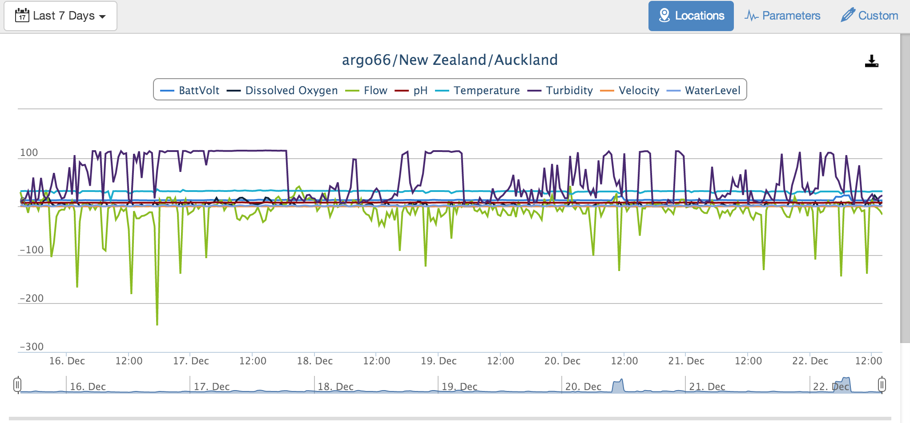
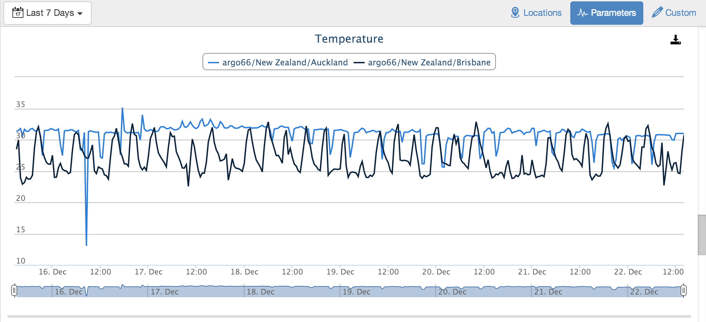
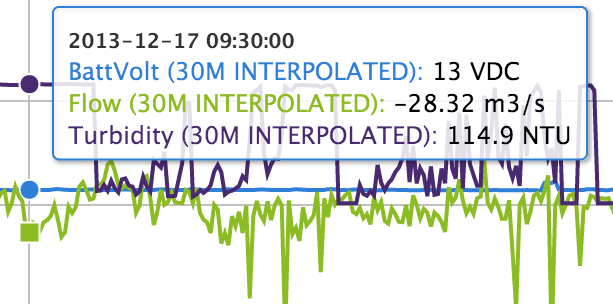
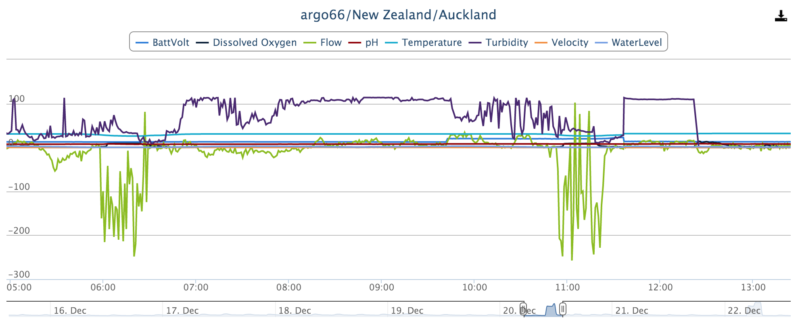
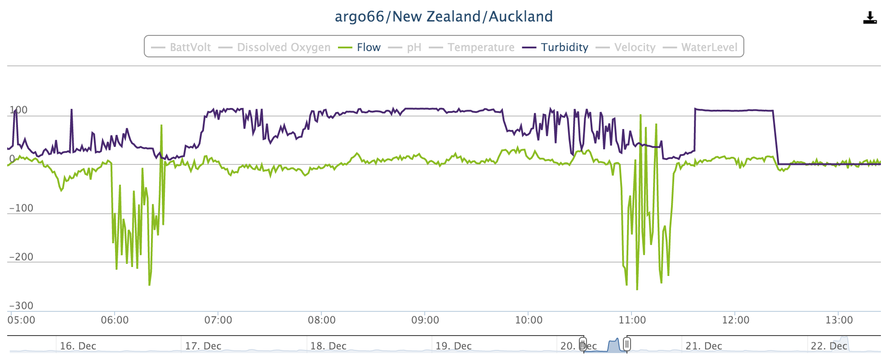

Chart
=========

|icon-chart| Use the Chart View for quickly reviewing your timeseries data in highly interactive charts. Choose to group data into charts by Location or by Parameter type. Charts are displayed using the chart settings configured for each individual parameter. See :ref:`Parameter configuration <node-configuration-parameter>` for full details.

.. note::
	The view displays content based on the Selected Node in the Workspaces Menu. Use filters to quickly target specific parameters or review alarms.

Subviews
---------

Locations
~~~~~~~~~
Locations Subview displays a chart per location. Any parameters contained within the location will be displayed on the chart. If a Location does not contain any parameters (or the parameters are all filtered) then no chart will be displayed.

| 

Parameters
~~~~~~~~~~
Parameters Subview displays a chart per parameter (based on parameter name). Useful for comparing parameters of the same type across multiple locations. Filters can be applied to reduce the number of charts and/or parameters being displayed.

| 

Custom
~~~~~~
Custom Subview displays the customised Chart Nodes. This feature is currently not available.

.. _working-with-charts:

Working with charts
-------------------

Parameter Values
~~~~~~~~~~~~~~~~

Hover over a chart with the mouse cursor or Touch part of the display area of a chart to display the value of the parameters corresponding with the time displayed on the x-axis.

Parameter values may be shown with aggregation applied - indicated with a duration and aggregate name in brackets immediately after the parameter name. Aggregation is based on the date range of the chart data and the parameter configuration settings. See :ref:`Parameter configuration <node-configuration-parameter>` for full details.

| 

Adjust Height
~~~~~~~~~~~~~

Drag any of the horizontal bars that separate the charts Up or Down to decrease or increase the height of all displayed charts.
This option is currently not available on touch devices.

Zoom
~~~~

Click and Drag (or pinch on touch devices) over the main chart area to zoom. As you zoom into the chart more detailed data is loaded (depending on the parameter configuration settings).

Use the navigator located directly under the main chart area to pan the chart or zoom in/out.

*Chart area selected for zoom*

.. image:: chart_zoom.png
	:scale: 50 %

| 

*Chart after zoom*

| 

Toggle Parameter display
~~~~~~~~~~~~~~~~~~~~~~~~
Click or touch the parameters in the legend above the main chart area to show/hide the corresponding parameters on the chart. The chart y-axis automatically scales based on the visible parameters.

| 

Save as image
~~~~~~~~~~~~~
|icon-download| Save the chart as an image by clicking or touching the download chart button on the top-right corner of the chart. Depending on the web browser you are using, the image may be saved automatically or opened in a new window.

Toolbar Controls
----------------

|icon-calendar| Date range selector is used to quickly adjust the date range being shown on all charts. You can always zoom in on individual charts, but you cannot zoom out past the range set by this selector. Use Custom Range to select precise start/end dates.

.. image:: chart_rangeselector.png
	:scale: 50 %

| 
