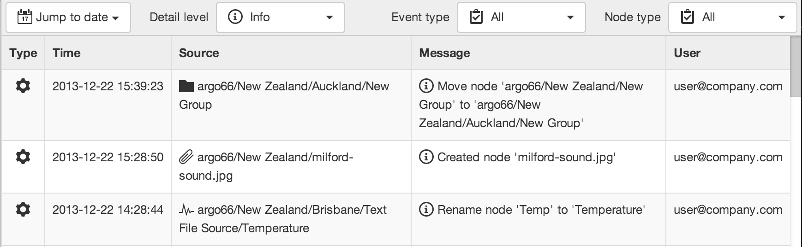
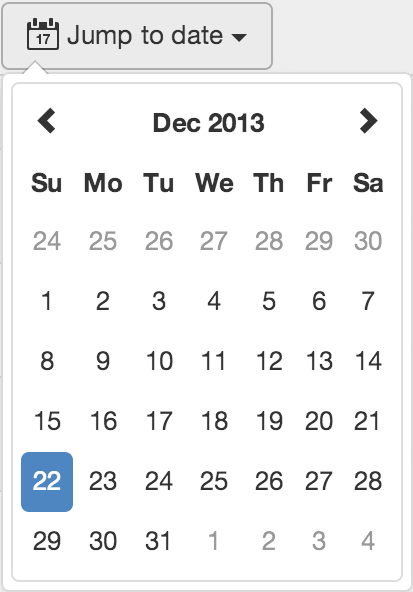

Events
========

|icon-events| Every interaction (user and system generated) is recorded in the Events log. Use the Events View to quickly audit the system, a user or history of alarms.

.. note::
	The view displays content based on the Selected Node in the Workspaces Menu. Use filters to quickly target specific parameters or review alarms.

infinite scroll...

Searching the Event Log
-----------------------

Jump to Date
~~~~~~~~~~~~

Detail Level
~~~~~~~~~~~~

|icon-debug| Debug

|icon-info| Info

|icon-warning| Warning

|icon-error| Error

Event Type
~~~~~~~~~~

|icon-select-all| All

|icon-datasource-acquire| Acquisition

|icon-properties| Configuration

|icon-state| State

|icon-notification| Notification

|icon-security| Security

Node Type
~~~~~~~~~

usual suspects

