Map
==========

|icon-map| Map provides a fully featured interactive interface for displaying location based data.

.. note::
	The view displays content based on the Selected Node in the Workspaces Menu. Use filters to quickly target specific parameters or review alarms.

.. image:: map_overview.png
	:scale: 50 %

| 

Layers and Display mode
------------------------

Change the appearance of the map using the Display mode dropdown, or select one of the available Layers to show additional information such as cloud imagery or regional weather data provided by Google.

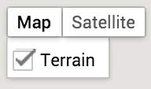

| 

Zoom and Pan
-------------

Use the standard google map controls to Zoom/Pan or enter Street View. You can also use your mouse wheel or pinch gestures to zoom.

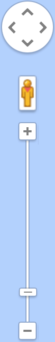

| 

Click and Hover
----------------

Hover over a Location icon with a mouse to quickly show its parameters. Click or Touch the Location to pin the parameters list open or closed. 

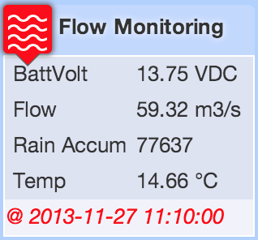

| 

Filters
--------
Use filters to quickly show locations of interest.

**Alarms Filter** will show only the Locations within the Selected Node that are currently in alarm or acknowledged state (including any contained Nodes).

**Parameter Filters** will show only the Locations within the Selected Node that contain parameters of the same name. Both Alarms and Parameter Filters can be combined.

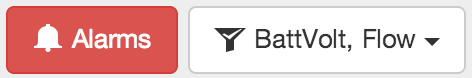

| 

The show/hide filtered locations button found in the toolbar can be used to toggle the display of filtered locations. When active you will notice any filters locations are displayed with just a *GRAY* marker and no label. You can still hover or click these filtered locations to display the parameters list.

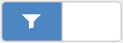

| 

*Map with filters applied*

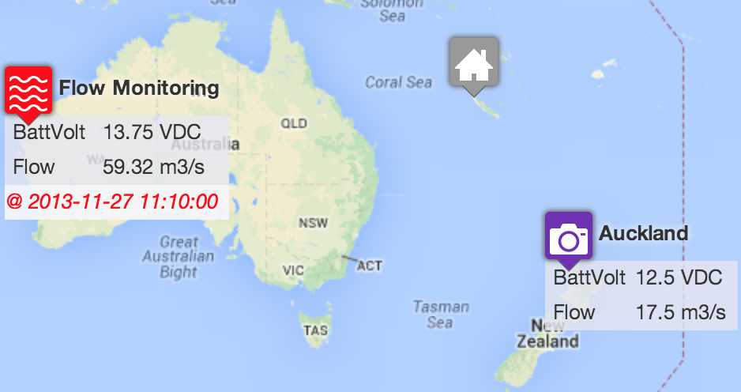

| 

When parameter filters are applied, the corresponding parameters for each applicable Location are automatically displayed. Hover or Click the locations to display all parameters. 

Locations containing alarms will have their marker displayed in *RED* If all alarms within a location have been acknowledged the marker will be displayed in *ORANGE*.

Reserved marker colors
-----------------------
These reserved marker colors temporarily overwrite the normal marker color.

*Active Alarm*

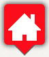

| 

*Acknowledged Alarm*

| 

*Filtered*

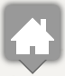

| 

Adding a new location marker
-----------------------------
|icon-location-add| Use the *Add Location* button in the toolbar or from the map context menu with a right-click or long-press on the map. The Add Location dialog will be displayed showing all locations within the Selected Node that have not been assigned coordinates.

*Map context menu*

.. image:: map_contextmenu.png
	:scale: 50 %

| 

*Add Location dialog*

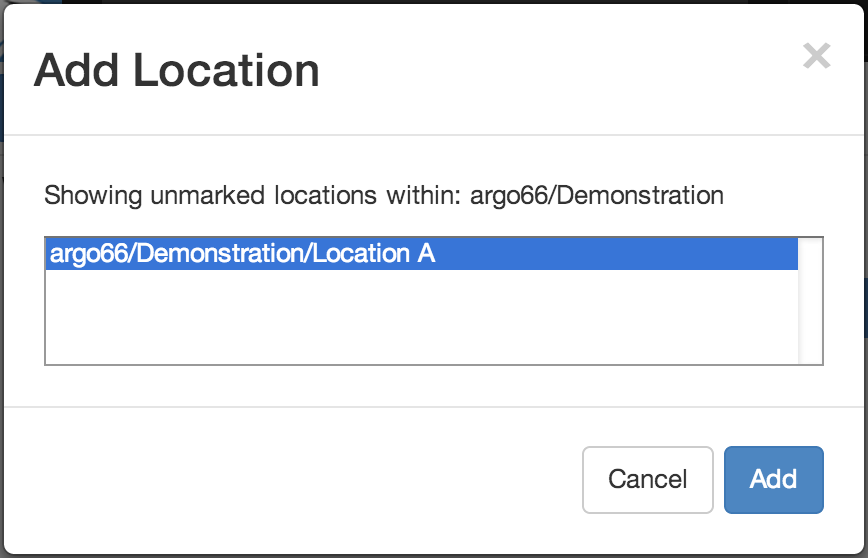

| 

*Drag and Drop* Locations directly from the Workspaces Menu if your using a mouse (and Workspaces Menu visible).

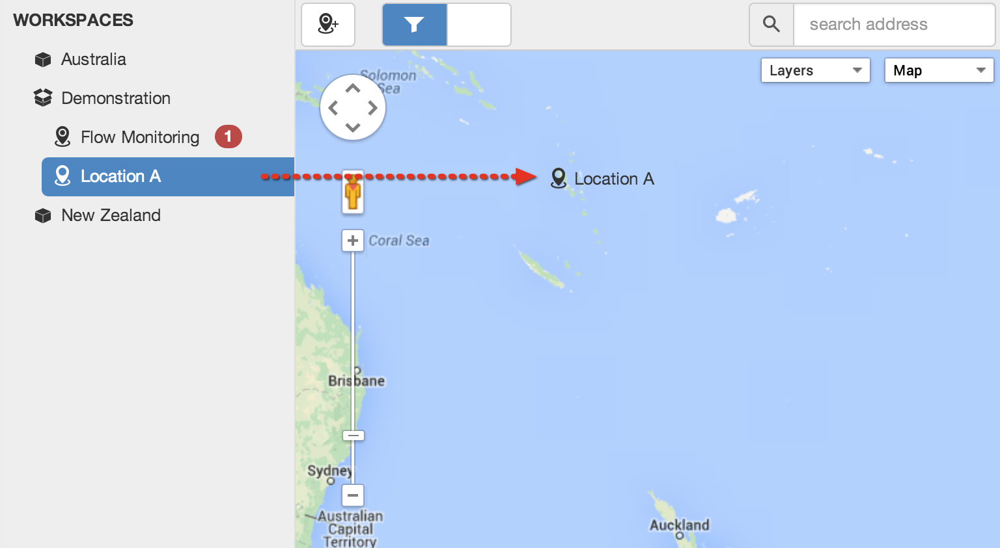

| 

Reposition marker
-----------------
|icon-move| Select *Reposition marker* from the map marker context menu to enter reposition mode. The marker will show with a bouncing effect while in reposition mode. Drag and drop the marker and pan/zoom the map until the marker is in the correct position. click or touch on the map background to apply the new coordinates. 

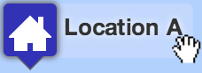

| 

Remove marker
-------------
|icon-remove| Select *Remove marker* from the map marker context menu to remove the marker from the map.
This operation resets the location coordinates only. It does not delete the Location Node or any historic data.

.. note::
	The location must use Fixed Coordinates and you must have configure permission for the Workspace to Add, Reposition or Remove the marker. Locations with Dynamic Coordinates will automatically be added, repositioned and removed as the coordinate Source receives updates.

