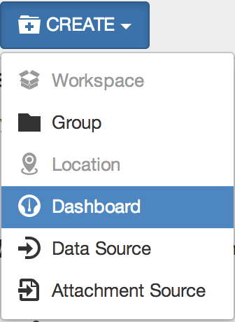

Workspaces Menu
===============

The Workspaces Menu is the place to go for organising, configuring and managing your Nodes. This sections provides an overview of the common Workspaces Menu functions. Depending on the Selected Node type and your security permissions, not all options may be available.

.. note:: 
	Most operations require you to display the Context Menu. Right-click or long-press on a Node in the Workspace Menu to display its Context Menu.

Create
------

|icon-create| New Nodes can be created using the *Create Menu* or from the *Context Menu*.

*Create Menu*

The Create Menu displays a list of the types of Nodes that can be created inside the currently Selected Node. Items that are disabled can not be created inside the Selected Node - either a restriction on the type of Node or you do not have the required security permissions.

*Create using Context Menu*

The Context Menu has a Create submenu which offers the same options as the Create Menu.

Rename
------
|icon-rename| Rename a Node from the context menu or press the *F2* key after selecting a Node. 

The Node will be selected and you can type in a new name and press enter/return or click anywhere outside the Node to apply.

.. note:: 
	Nodes must be uniquely named within the current container Node. Restricted characters include forward slash '/' and underscore '_'.

Delete
------
|icon-remove| Permanently delete a Node using the Context menu or press the *delete* key after selecting the Node. A confirmation message will be displayed.

| 

.. note:: 
	Deleting a Node will also delete any of the Nodes it contains including any associated historic data, events, attachments and configuration. This operation is NOT reversible.

Copy and Paste
--------------
Copy *(Ctrl+C)* and Paste *(Ctrl+V)* is the quickest and easiest way to duplicate a Node including all Nodes it contains. You must have configuration permission for the Node you intend to copy and the destination Node where you intend to paste.

|icon-copy| Copy a Node 

|icon-paste| Paste a Node anywhere in the Workspaces Menu that accepts the copied Node type.

.. note:: 
	The copy operation is done at the time of pasting. The original Node being copied must exist or the paste operation will be aborted.

Move
----
Move a Node (including all Nodes it contains) within a Workspace or between Workspaces.

*Click and Drag* a Node in the Workspaces Menu. Drag the Selected Node to the destination Node and release the mouse button when you see the destination node highlighted. Nodes will automatically expand when hovered.

| 

.. note:: 
	Moving Nodes in the Workspaces Menu is currently not supported on Touch devices.
