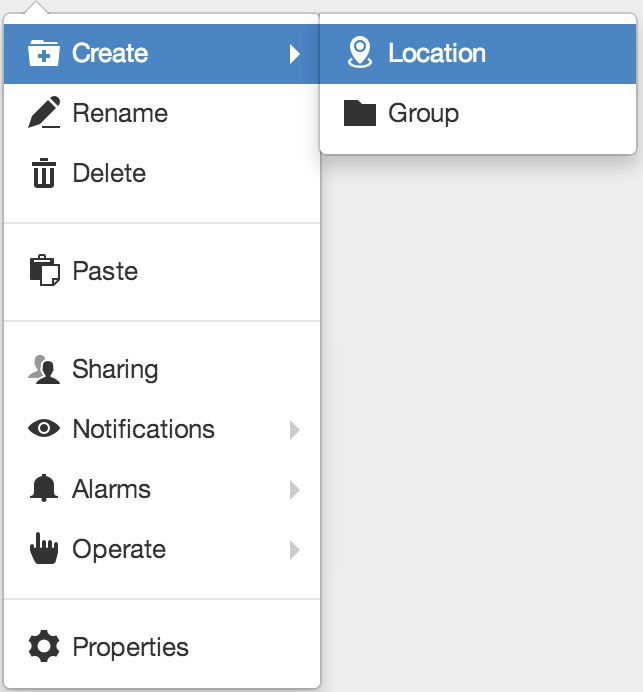
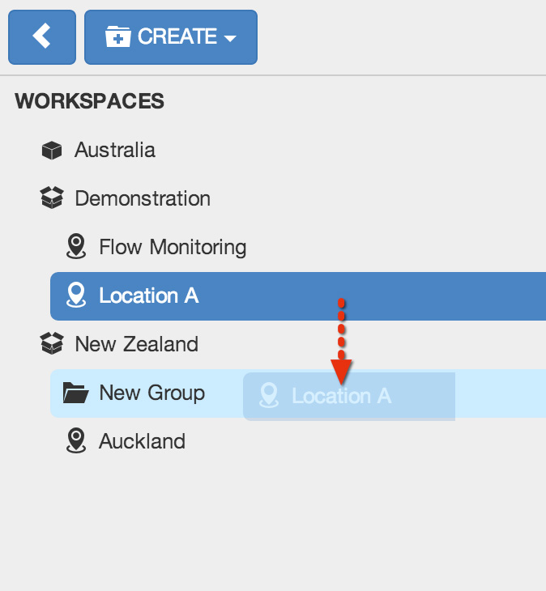

.. _workspaces_tree:

Workspaces Tree
===============

The Workspaces Tree is the place to go for organising, configuring and managing your Nodes. This sections provides an overview of the common Workspaces Tree functions. Depending on the Selected Node type and your security permissions, not all options may be available.

.. note:: 
	Most operations require you to display the Context Menu. Right-click or long-press on a Node in the Workspace Menu to display its Context Menu.

.. only:: not latex

    |

Create
------

|icon-create| New Nodes can be created using the *Create Menu* or from the *Context Menu*.

*Create Menu*

.. only:: not latex

	.. image:: workspaces_tree_create.jpg
		:scale: 50 %

	| 

.. only:: latex
	
	.. image:: workspaces_tree_create.jpg
		:scale: 35 %

The Create Menu displays a list of the types of Nodes that can be created inside the currently Selected Node. Items that are disabled can not be created inside the Selected Node - either a restriction on the type of Node or you do not have the required security permissions.

.. raw:: latex

    \newpage

*Create using Context Menu*

.. only:: not latex

	| 

The Context Menu has a Create submenu which offers the same options as the Create Menu.

.. only:: not latex

    |

Rename
------
|icon-rename| Rename a Node from the context menu or press the *F2* key after selecting a Node. 

The Node will be selected and you can type in a new name and press enter/return or click anywhere outside the Node to apply.

.. note:: 
	Nodes must be uniquely named within the current container Node. Restricted characters include forward slash '/', underscore '_' and semicoloon ';'.

.. only:: not latex

    |

Delete
------
|icon-remove| Permanently delete a Node using the Context menu or press the *delete* key after selecting the Node. A confirmation message will be displayed.

.. only:: not latex

	.. image:: workspaces_tree_delete.jpg
		:scale: 50 %

	| 

.. only:: latex

	.. image:: workspaces_tree_delete.jpg
		:scale: 70 %

.. note:: 
	Deleting a Node will also delete any of the Nodes it contains including any associated historic data, events, attachments and configuration. This operation is NOT reversible.

.. only:: not latex

    | 

Copy and Paste
--------------
Copy *(Ctrl+C)* and Paste *(Ctrl+V)* is the quickest and easiest way to duplicate a Node including all Nodes it contains. You must have configuration permission for the Node you intend to copy and the destination Node where you intend to paste.

|icon-copy| Copy a Node 

|icon-paste| Paste a Node anywhere in the Workspaces Tree that accepts the copied Node type.

.. note:: 
	The copy operation is done at the time of pasting. The original Node being copied must exist or the paste operation will be aborted.

.. only:: not latex

    | 

Move
----
|icon-move| Move a Node (including all Nodes it contains) within a Workspace or between Workspaces. You can also move Workspaces between accounts that you have permission to access.

Select *Move* from the Context Menu to open the *Move dialog* and select a destination node for the move operation.

Alternatively *Click and Drag* a Node in the Workspaces Tree to the destination Node and release the mouse button when you see the destination node highlighted. Nodes will automatically expand when hovered.

|  

.. only:: not latex

	| 

Workspace Loading On-demand
---------------------------
If you have access to more than one Workspace you may notice some of the Workspaces are *GRAYED* out in the Workspaces Tree when you first login.
Click on the Workspace or select *Load Workspace* from the Workspace context menu to load its assets. 

You can load all Workspaces by selecting *Load Workspaces* from the top-level *WORKSPACES* context menu.

.. raw:: latex

    \vspace{-10pt}

.. only:: not latex

    .. image:: workspaces_tree_ondemand.jpg
        :scale: 50 %

    | 

.. only:: latex

    | 

    .. image:: workspaces_tree_ondemand.jpg
        :scale: 60 %

.. only:: not latex

    | 

Workspace Grouping by Account
------------------------------
If you have access to more than one account you will notice Workspaces are automatically grouped under the associated account in the Workspaces Tree.

Selecting an account will display content related to all *Loaded Workspaces* you have access to for that account.

.. raw:: latex

    \vspace{-10pt}

.. only:: not latex

    .. image:: workspaces_tree_grouping.jpg
        :scale: 50 %

    | 

.. only:: latex

    | 

    .. image:: workspaces_tree_grouping.jpg
        :scale: 35 %

.. only:: not latex

    | 

Disabled Nodes
---------------
You may notice *GREY* Nodes within a Workspace.

Sources being configured for the first time will be shown as disabled until they have been fully configured.
Parameters that had been created and then unchecked (or unavailable) for collection will also be shown as disabled in the Workspaces Tree, List and Map Views.

.. raw:: latex

    \vspace{-10pt}

.. only:: not latex

	.. image:: workspaces_tree_disabled.jpg
		:scale: 50 %

	| 

.. only:: latex

	| 

	.. image:: workspaces_tree_disabled.jpg
		:scale: 35 %

.. only:: not latex

    | 

Demo Nodes
-----------
You may notice *PURPLE* Nodes in the Workspaces Tree and Content Views.

Sample Data Source nodes are initially added to new accounts for demonstration purposes and do not incur usage charges. You can safely delete these demo nodes at any time.

.. raw:: latex

    \vspace{-10pt}

.. only:: not latex

    .. image:: workspaces_tree_demo.jpg
        :scale: 50 %

    | 

.. only:: latex

    | 

    .. image:: workspaces_tree_demo.jpg
        :scale: 35 %

.. raw:: latex

    \newpage
    